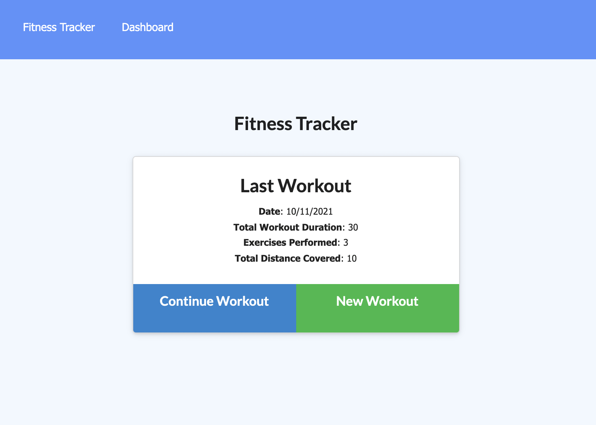
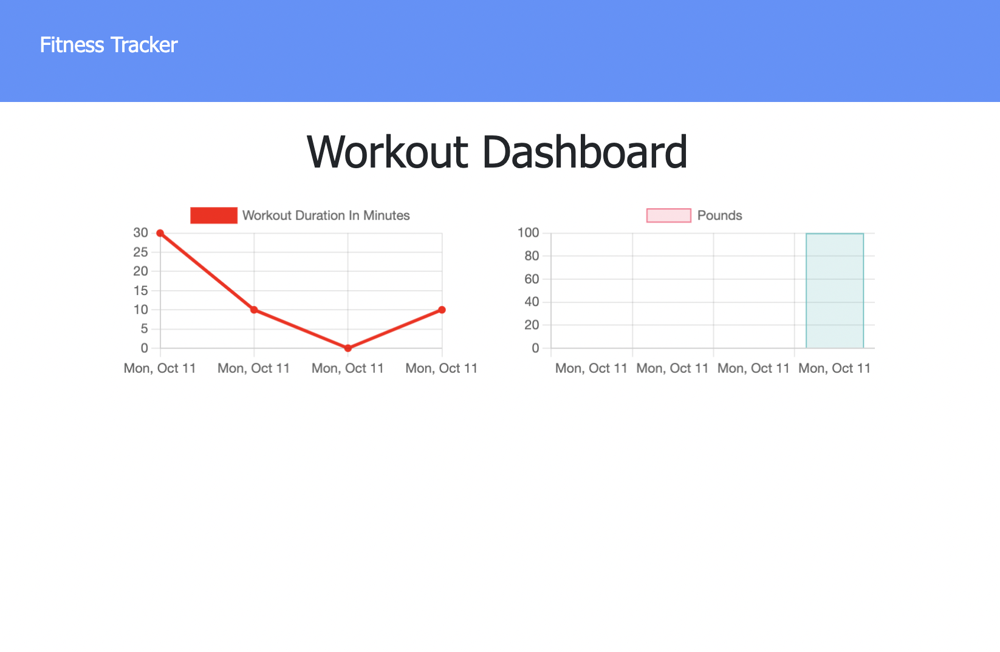

# Workout-Tracker

A web application used to track workout progress by recording multiple workouts, as well as providing the total distance and weights of workouts over the course of seven days. The project uses a MongoDB and node.js to track the workouts over time. 
## Table of Contents 
* [User Story](#userstory)
* [Screenshots](#screenshots)
* [Installation](#installation)
* [Usage](#usage)
* [Technology](#technology)
* [License](#license)
* [Contributors](#contributors)
* [Tests](#tests)
* [Questions](#questions)

## User Story

```md
As a user, I want to be able to view create and track daily workouts. I want to be able to log multiple exercises in a workout on a given day. I should also be able to track the name, type, weight, sets, reps, and duration of exercise. If the exercise is a cardio exercise, I should be able to track my distance traveled.
```

## Screenshots 




## Installation
Run `npm install` to install application dependencies (express, mongoose).


## Usage
This app is deployed on Heroku [here](https://vb-workout-tracker.herokuapp.com/).

To run locally on CML, run `node server.js`. Once the server is started,the app can open at localhost:3001 in a browser of choice.

## Technology
- Node.js
- NPM 
- Express 
- JavaScript 
- MongoDB
- Mongoose
- Heroku 


## Contributors
:woman_with_headscarf: [Valbona Bajrami](https://github.com/valbona1992)
  
## License
License is [MIT](https://opensource.org/licenses/MIT) standard license.

## Tests
No testing at this time.

## Questions
GitHub: https://github.com/valbona1992  <br/>
Email me with any questions: valbona12@gmail.com 